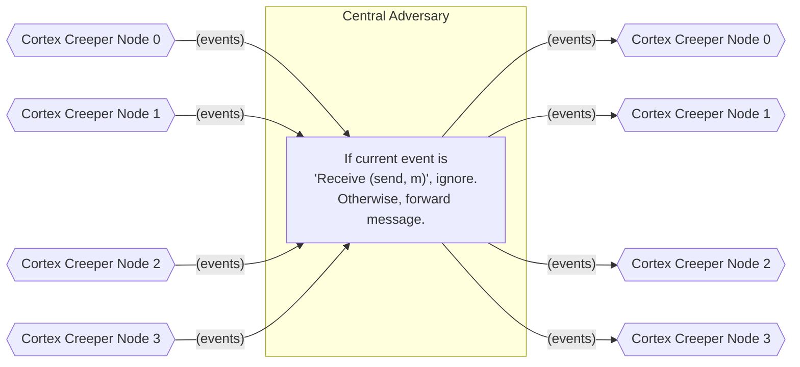

```mermaid
flowchart LR;

cc00{{Cortex Creeper Node 0}}
cc01{{Cortex Creeper Node 1}}
cc02{{Cortex Creeper Node 2}}
cc03{{Cortex Creeper Node 3}}

cc10{{Cortex Creeper Node 0}}
cc11{{Cortex Creeper Node 1}}
cc12{{Cortex Creeper Node 2}}
cc13{{Cortex Creeper Node 3}}

subgraph ca[Central Adversary]

bb["If current event is<br>'Receive (send, m)', ignore.<br>Otherwise, forward message."]

end

cc00 --(events)--> bb
cc01 --(events)--> bb
cc02 --(events)--> bb
cc03 --(events)--> bb

bb --(events)--> cc10
bb --(events)--> cc11
bb --(events)--> cc12
bb --(events)--> cc13

```
