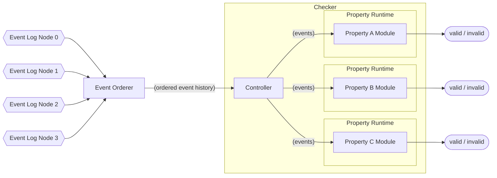

```mermaid
flowchart LR;

elog0{{Event Log Node 0}}
elog1{{Event Log Node 1}}
elog2{{Event Log Node 2}}
elog3{{Event Log Node 3}}

eOrderer[Event Orderer]

elog0 --> eOrderer
elog1 --> eOrderer
elog2 --> eOrderer
elog3 --> eOrderer

eOrderer --(ordered event history)--> controller


subgraph checker[Checker]

controller[Controller]

subgraph checkerRuntimeA[Property Runtime]
propertyA[Property A Module]
end

subgraph checkerRuntimeB[Property Runtime]
propertyB[Property B Module]
end

subgraph checkerRuntimeC[Property Runtime]
propertyC[Property C Module]
end


controller --(events)--> propertyA
controller --(events)--> propertyB
controller --(events)--> propertyC

end

resA([valid / invalid])
resB([valid / invalid])
resC([valid / invalid])

propertyA --> resA
propertyB --> resB
propertyC --> resC

```
