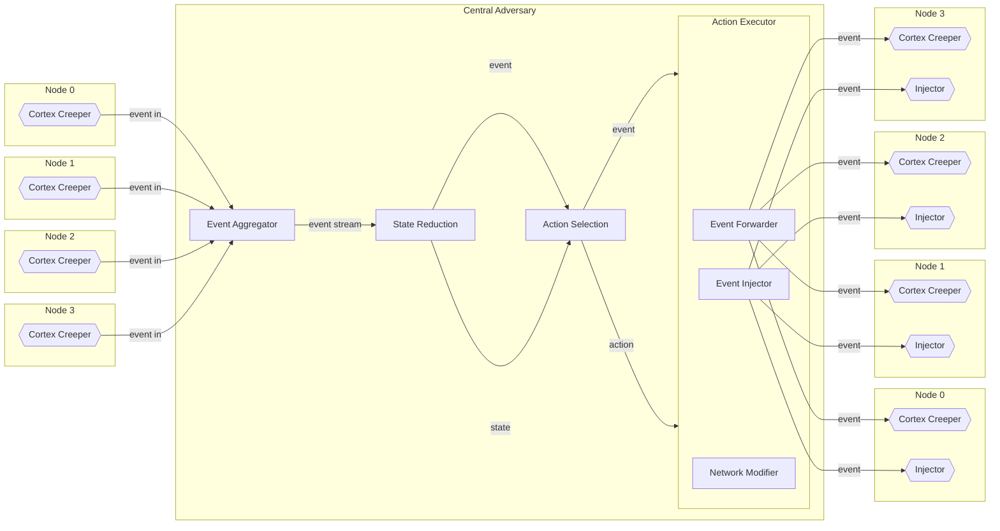

```mermaid
flowchart LR;

subgraph n00[Node 0]
cc00{{Cortex Creeper}}
end
subgraph n01[Node 1]
cc01{{Cortex Creeper}}
end
subgraph n02[Node 2]
cc02{{Cortex Creeper}}
end
subgraph n03[Node 3]
cc03{{Cortex Creeper}}
end

subgraph n10[Node 0]
cc10{{Cortex Creeper}}
i10{{Injector}}
end
subgraph n11[Node 1]
cc11{{Cortex Creeper}}
i11{{Injector}}
end
subgraph n12[Node 2]
cc12{{Cortex Creeper}}
i12{{Injector}}
end
subgraph n13[Node 3]
cc13{{Cortex Creeper}}
i13{{Injector}}
end

subgraph ca[Central Adversary]

    ea[Event Aggregator]
    sr[State Reduction]

    ea -- event stream --> sr

    as[Action Selection]
    sr -- event --> as
    sr -- state --> as

    as -- event --> ae
    as -- action --> ae

end

cc00 -- event in --> ea
cc01 -- event in --> ea
cc02 -- event in --> ea
cc03 -- event in --> ea

ef -- event --> cc10
ef -- event --> cc11
ef -- event --> cc12
ef -- event --> cc13

ei -- event --> i10
ei -- event --> i11
ei -- event --> i12
ei -- event --> i13


subgraph ae[Action Executor]
    direction RL

    ei[Event Injector]
    ef[Event Forwarder]
    nm[Network Modifier]
end

```
